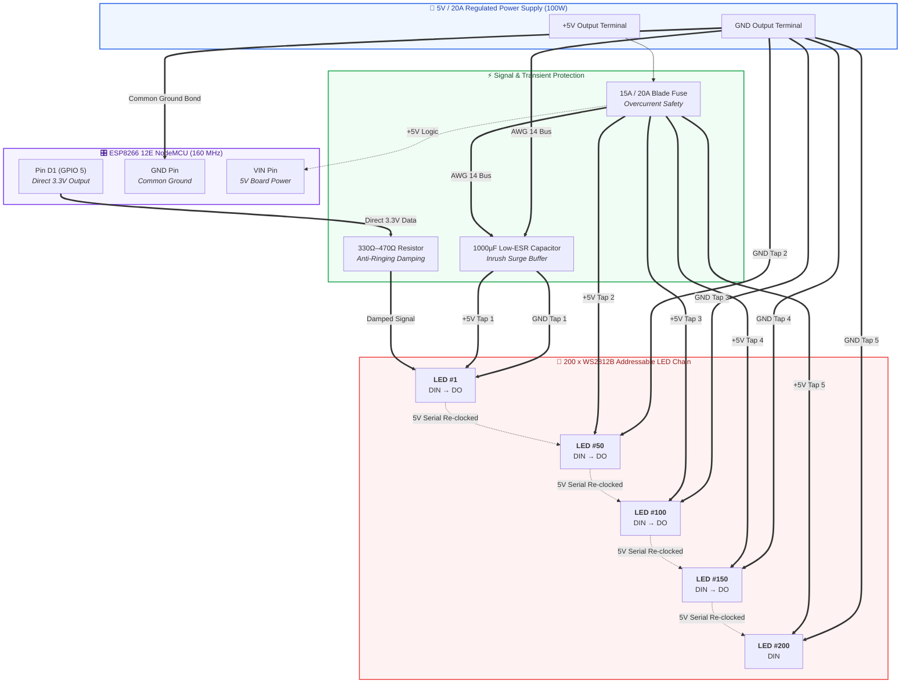

# ESP8266 PixelMatrix 200

[](https://platformio.org/)
[-blue.svg?logo=arduino)](https://github.com/esp8266/Arduino)
[](https://nodemcu.readthedocs.io/)
[](#core-specifications)
[](LICENSE)

**ESP8266 PixelMatrix 200** is an open-source, production-grade addressable LED controller designed to drive **200 physical WS2812B LEDs** directly from an **ESP8266 12E NodeMCU** board **without any logic level shifter**.

Featuring a non-blocking FastLED animation engine, distributed 5-point power injection, persistent flash preset storage, high-speed binary WebSocket telemetry streaming (20 FPS live pixel preview), Wi-Fi AP fallback, and an embedded modern light-theme web dashboard stored in LittleFS.

---

## Key Hardware Architecture



<details>
<summary><b>📐 Click to expand ASCII Hardware Schematic Blueprint</b></summary>

```text
╭────────────────────────────────────────────────────────────────────────╮
│                        ESP8266 12E NodeMCU                             │
│                     [Tensilica 32-bit @ 160MHz]                        │
│                                                                        │
│   [ VIN ]                      [ GND ]                [ Pin D1 / GPIO 5 ]
╰──────┬────────────────────────────┬────────────────────────────┬───────╯
       │ (+5V Power)                │ (Common Ground)            │ (Direct 3.3V Logic)
       │                            │                            │
       │                            │                       ┌────┴────┐
       │                            │                       │  330 Ω  │ Series Resistor
       │                            │                       └────┬────┘
       │                            │                            │
       │   ┌────────────────────────┴────────────────────────┐   │
       │   │           GND Bus (AWG 14 Heavy Cable)          │   │
       │   └──┬─────────────┬─────────────┬─────────────┬────┘   │
       │      │             │             │             │        │
       │      │             │             │             │        ▼ (Direct DIN)
 ┌─────┴──────┴────┐  ┌─────┴─────┐ ┌─────┴─────┐ ┌─────┴─────┐ ┌────────────────┐
 │     LED #1      │  │  LED #50  │ │  LED #100 │ │  LED #150 │ │    LED #200    │
 │   [WS2812B]     ├──┤ [WS2812B] ├─┤ [WS2812B] ├─┤ [WS2812B] ├─┤   [WS2812B]    │
 └─────┬──────┬────┘  └─────┬─────┘ └─────┬─────┘ └─────┬─────┘ └────────────────┘
       │      │             │             │             │
       │   ┌──┴─────────────┴─────────────┴─────────────┴────┐
       │   │           +5V Bus (AWG 14 Heavy Cable)          │
       │   └────────────────────────┬────────────────────────┘
       │                            │
 ┌─────┴────────────────────────────┴─────┐
 │       1000 µF / 16V Low-ESR Cap        │
 └──────────────────┬─────────────────────┘
                    │
           ┌────────┴────────┐
           │ 15A / 20A Fuse  │ Inline Protection
           └────────┬────────┘
                    │
      ┌─────────────┴─────────────┐
      │  5V / 20A Regulated PSU   │
      │   (100W Switching Supply) │
      └───────────────────────────┘
```
</details>

### Core Specifications
- **Microcontroller:** ESP8266 12E NodeMCU (Tensilica L106 32-bit clocked at **160 MHz**, 80KB RAM, 4MB Flash).
- **Physical LEDs:** 200 WS2812B individually addressable 5050 RGB pixels.
- **Data Signal:** Direct 3.3V drive on **Pin D1 (GPIO 5)** through a 330Ω–470Ω inline resistor. **Strictly NO level shifter.**
- **Power Supply:** External 5.0V DC / 20.0A (100W) regulated PSU.
- **Power Injection:** 5 distributed taps (LEDs #1, #50, #100, #150, #200) via AWG 14 bus.
- **Transient Protection:** 1000µF Low-ESR electrolytic capacitor across +5V and GND.
- **Common Ground:** ESP8266 GND bonded directly to 5V PSU GND.

---

## Wiring Summary

| Signal | ESP8266 NodeMCU Pin | Physical GPIO | Destination |
| :--- | :--- | :--- | :--- |
| **LED Data** | **`D1`** | `GPIO 5` | WS2812B DIN (via 330–470Ω series resistor) |
| **GND** | **`GND`** | — | 5V PSU Ground & LED Strip Ground *(Common Ground)* |
| **+5V** | **`VIN`** (or external) | — | 5V Power Supply |

> [!IMPORTANT]
> **Common Ground**: You MUST connect the ESP8266 GND pin directly to the 5V power supply ground. Without common ground, the data signal will float and LEDs will flicker uncontrollably.
>
> **Never Power the LEDs from the NodeMCU**: 200 WS2812B LEDs can draw up to 12A at full white. Power the LED strip directly from your 5V power supply.

---

## Software & Firmware Features

- **Non-Blocking Architecture:** Zero blocking `delay()` calls; non-blocking loop driven by `millis()` and cooperative yielding (`yield()`) to ensure the ESP8266 Wi-Fi stack and watchdog remain healthy.
- **20 Real Physical Lighting Effects:** Solid Color, Rainbow, Rainbow Chase, Color Wipe, Breathing, Fire, Ocean, Plasma, Twinkle, Sparkle, Comet, Meteor, Scanner, Theater Chase, Police, Strobe, Running Lights, Gradient, Random Colors, and Color Cycle.
- **Hardware Diagnostic Suite:** 11 dedicated test modes for physical chain debugging (LED #1 isolation, First 10, First 50, All 200, Red, Green, Blue, White, Sequential Forward, Reverse Sequential, and Individual LED index).
- **First-Boot Sanity Check:** Automatic safe sequence (Red $\rightarrow$ Green $\rightarrow$ Blue $\rightarrow$ White $\rightarrow$ Clear) at 25% brightness on startup.
- **Safety Current Throttling:** Configurable `MAX_SAFE_BRIGHTNESS_PCT` limit and real-time current (A), wattage (W), and PSU utilization (%) estimation.
- **Persistent Storage:** Settings and custom presets stored in non-volatile flash using debounced write deferral to maximize flash endurance.
- **Wi-Fi Manager with AP Fallback:** Connects to Station Wi-Fi; automatically launches standalone AP `PixelMatrix-Setup` (`192.168.4.1`, password: `pixel1234`) if connection is unavailable.
- **mDNS Support:** Accessible on local network at `http://pixelmatrix-200.local`.
- **ArduinoOTA:** Wireless over-the-air firmware updates supported.

---

## Modern Web Dashboard (Stored in LittleFS)

- **Light-Themed UI:** Clean, modern interface designed with soft lavender/blue gradients, crisp cards, and responsive layout.
- **Live 200-Pixel Preview:** 20 columns $\times$ 10 rows interactive matrix streaming real-time hardware LED states via binary WebSocket packets at 20 FPS.
- **Studio Controls:** Master Power toggle, Brightness slider with safe limit indicator, Dual Color pickers (HEX + RGB) with quick swatches, Speed and Intensity modifiers, Direction toggle.
- **Effects Gallery:** 20 interactive cards with active state highlights.
- **Preset System:** Save, load, rename, and delete custom lighting scenes.
- **Diagnostics Panel:** Live hardware telemetry table showing CPU clock, free heap, uptime, Wi-Fi RSSI, and electrical estimates.

---

## Quickstart: How to Flash Your ESP8266

This repository includes ready-to-flash, pre-compiled release binaries in the [`bin/`](bin/) folder. **No development environment, C++ compiler, or PlatformIO setup is required.**

### Pre-Compiled Release Files in [`bin/`](bin/)
* **`bin/merged_firmware_4mb.bin`**: All-in-one bundle containing both the firmware and the LittleFS web dashboard. Flashed at memory offset `0x00000`.
* **`bin/firmware.bin`**: Main firmware binary (offset `0x00000`).
* **`bin/littlefs.bin`**: Web dashboard filesystem image containing `index.html`, `style.css`, and `app.js` (offset `0x300000`).

---

### Option 1: 1-Click Script (Recommended)

1. Connect your ESP8266 NodeMCU to your computer via USB.
2. Open the `bin/` folder.
3. Run the script for your operating system:
   * **Windows**: Double-click [`bin/flash_windows.bat`](bin/flash_windows.bat)
   * **Linux / macOS**: Run `bash bin/flash_linux_mac.sh`

---

### Option 2: Browser-Based Web Flashing (Zero Installation)

You can flash directly from Google Chrome, Edge, or Opera without installing any tools:
1. Open [Adafruit WebSerial ESPTool](https://adafruit.github.io/Adafruit_WebSerial_ESPTool/) or [ESP Web Tools](https://esp.rainmaker.espressif.com/).
2. Click **Connect** and select your NodeMCU COM port (`CH340` or `CP2102`).
3. Set Baud Rate to **460800**.
4. Select [`bin/merged_firmware_4mb.bin`](bin/merged_firmware_4mb.bin) at address **`0x00000`**.
5. Click **Program / Flash**.

---

### Option 3: Command Line with `esptool.py`

If you have Python installed:
```bash
pip install esptool
esptool.py --chip esp8266 --port COM6 --baud 460800 write_flash 0x00000 bin/merged_firmware_4mb.bin
```
*(Replace `COM6` with your serial port, e.g. `/dev/ttyUSB0` on Linux).*

---

## Documentation Index

- [Wiring Guide & Schematics](docs/WIRING.md) — Comprehensive wiring topology and direct 3.3V logic explanation.
- [Hardware BOM & Pinout](docs/HARDWARE.md) — Detailed bill of materials, NodeMCU pin assignments, and wire gauges.
- [Power System Engineering & Math](docs/POWER.md) — Current, wattage, voltage drop calculations, and power injection math.
- [Firmware Flashing Guide](docs/FIRMWARE_FLASHING.md) — Step-by-step flashing, troubleshooting drivers, and LittleFS setup.
- [REST & WebSocket API Reference](docs/API.md) — Complete endpoint documentation and binary preview protocol.
- [Safety Precautions & Guidelines](docs/SAFETY.md) — Overcurrent protection, fuses, fire safety, and thermal limits.
- [15-Point Troubleshooting Guide](docs/TROUBLESHOOTING.md) — Diagnostic steps for hardware, Wi-Fi, and data line issues.
- [Contributing Guidelines](CONTRIBUTING.md) — Guidelines for submitting issues, features, and pull requests.

---

## License

This project is open source and licensed under the [MIT License](LICENSE).
