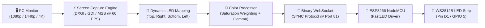

# Real-Time Dynamic Screen Sync (Ambilight) Guide

The **PixelMatrix Screen Sync** system transforms any monitor or TV into an immersive ambient lighting display. Unlike traditional fixed-matrix controllers, PixelMatrix uses a **dynamic perimeter sampling model** where you configure the exact physical LED layout around your monitor.

---

## 1. Pipeline Architecture



---

## 2. Low-Overhead Binary Protocol (`"SYNC"`)

The desktop app streams binary frames directly to `ws://<ESP_IP>:81/` using a compact packet format:

| Byte Offset | Field | Type | Description |
|---|---|---|---|
| `0..3` | **Magic Header** | `char[4]` | Always `"SYNC"` (`0x53, 0x59, 0x4E, 0x43`) |
| `4` | **Protocol Version** | `uint8` | `0x01` |
| `5` | **Packet Type** | `uint8` | `0x01` = Frame, `0x02` = Test, `0x03` = Heartbeat |
| `6..7` | **Frame Sequence ID** | `uint16_be` | Incremented frame counter |
| `8..9` | **LED Count ($N$)** | `uint16_be` | Dynamic LED count ($1 \le N \le 500$) |
| `10` | **Flags / Reserved** | `uint8` | `0x00` |
| `11` | **Header Checksum** | `uint8` | XOR of bytes `0..10` |
| `12 .. 12+3N-1` | **RGB Payload** | `uint8[3N]` | $N \times 3$ raw RGB bytes |
| `12+3N` | **Payload Checksum** | `uint8` | XOR of all RGB payload bytes |

*Total packet size for 200 LEDs: $12 + 600 + 1 = 613\text{ bytes}$*.

---

## 3. Launching the Desktop Application

### Prerequisites
Make sure Python 3.10+ is installed:
```bash
pip install -r desktop/requirements.txt
```

### Run
```bash
python desktop/main.py
```

---

## 4. Configuring Physical LED Layout

In the **Layout** tab:
1. **Set Perimeter Counts**:
   - **Top**: Number of physical LEDs along the top bezel (e.g. `60`)
   - **Right**: Number of physical LEDs down the right edge (e.g. `40`)
   - **Bottom**: Number of physical LEDs along the bottom bezel (e.g. `60`)
   - **Left**: Number of physical LEDs up the left edge (e.g. `40`)
   - *Total LEDs are calculated automatically: $60 + 40 + 60 + 40 = 200$.*
2. **Select Start Corner**: Where LED #1 DIN is physically connected:
   - `top-left`, `top-right`, `bottom-right`, or `bottom-left`.
3. **Select Direction**:
   - `clockwise` or `counter-clockwise`.
4. **Side Reversal**: Toggle `Reverse` on individual sides if your strip was folded backwards.
5. **Screen Source**: Select primary or secondary monitor from detected displays.
6. Click **Save Layout Configuration**.

---

## 5. Color Tuning & Calibration

### Tuning Controls
- **Master Brightness**: Overall output scale ($0\text{--}100\%$).
- **Saturation Boost**: Enhances vibrant colors ($0\text{--}200\%$, default $120\%$).
- **Gamma Correction**: Perceptual contrast exponent (default $2.2$).
- **Black Threshold**: Clamps dim pixels to clean black in dark movie/game scenes.
- **Temporal Smoothing**:
  - `OFF`: Instantaneous raw frame updates.
  - `LOW`: Subtle jitter reduction while keeping instant response on scene cuts.
  - `MEDIUM` / `HIGH`: Cinematic soft ambient glow.

### Physical LED Verification Suite
- **Full Screen Test Colors**: Click Red, Green, Blue, or White to verify physical color channels.
- **Probe Single LED**: Enter any LED number ($1\text{--}N$) to light only that physical pixel in white.
- **Chaser Sequence Test**: Runs a continuous chaser dot from LED #1 to #N to confirm physical wiring continuity.

---

## 6. Safety & Fail-Safe Operation

- **Hardware Current Limiting**: FastLED's internal power calculation safeguard remains strictly enforced on the ESP8266. Full white screens cannot exceed your configured PSU limit.
- **Automatic Fallback**: If the PC goes to sleep or the desktop app disconnects, the ESP8266 automatically falls back to your previous lighting effect after 3 seconds.
